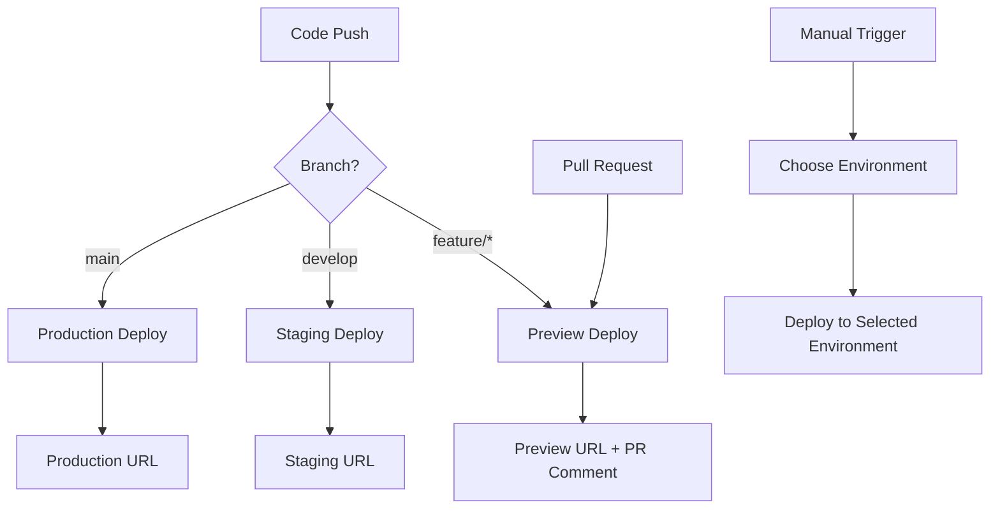

# 🚀 PoD Protocol Deployment Guide

This guide covers the complete deployment setup for the PoD Protocol project, including GitHub Actions workflows and Vercel frontend deployment.

## 📋 Table of Contents

- [Overview](#overview)
- [GitHub Actions Workflows](#github-actions-workflows)
- [Vercel Frontend Deployment](#vercel-frontend-deployment)
- [Required Secrets](#required-secrets)
- [Deployment Environments](#deployment-environments)
- [Manual Deployment](#manual-deployment)
- [Troubleshooting](#troubleshooting)

## 🔍 Overview

The PoD Protocol uses a comprehensive CI/CD pipeline that includes:

- **Automated testing and building** for all components
- **Frontend deployment** to Vercel with preview and production environments
- **Package publishing** to NPM and GitHub Packages
- **Documentation deployment** to GitHub Pages
- **Release automation** with semantic versioning

## 🔄 GitHub Actions Workflows

### 1. CI Workflow (`ci.yml`)

**Triggers:** Push to any branch, Pull Requests

**Jobs:**
- **Lint & Format**: TypeScript, Prettier, Rust (Clippy & Rustfmt), Frontend
- **Build All**: Solana programs, SDK, CLI, Frontend
- **Test Suite**: Anchor tests, SDK tests, CLI tests

**Key Features:**
- Comprehensive caching for faster builds
- Parallel job execution
- Artifact uploading for downstream workflows

### 2. Frontend Deploy Workflow (`frontend-deploy.yml`)

**Triggers:** 
- Push to `main` (production deployment)
- Push to `develop` (staging deployment)
- Pull Requests (preview deployment)
- Manual dispatch

**Jobs:**
- **Frontend Lint & Test**: Ensures code quality
- **Frontend Build**: Creates optimized build artifacts
- **Deploy Preview**: For pull requests
- **Deploy Production**: For main branch
- **Deploy Staging**: For develop branch

**Key Features:**
- Automatic PR comments with preview URLs
- Environment-specific deployments
- Build artifact caching
- Deployment summaries

### 3. Documentation Deploy Workflow (`docs-deploy.yml`)

**Triggers:** Push to main, changes to documentation files

**Jobs:**
- Generates TypeScript documentation
- Deploys to GitHub Pages
- Creates deployment notifications

### 4. Package Publishing Workflow (`publish-packages.yml`)

**Triggers:** Git tags starting with 'v', manual dispatch

**Jobs:**
- Publishes SDK and CLI to NPM
- Publishes to GitHub Packages
- Supports both public and private registries

### 5. Release Workflow (`release.yml`)

**Triggers:** Git tags starting with 'v', manual dispatch

**Jobs:**
- Full test suite execution
- Multi-platform builds
- Package publishing
- GitHub release creation
- Discord notifications (optional)

### 6. Dependency Updates Workflow (`dependency-updates.yml`)

**Triggers:** Weekly schedule, manual dispatch

**Jobs:**
- Updates all dependencies
- Creates automated pull requests
- Supports multiple package managers

## 🌐 Vercel Frontend Deployment

### Configuration Files

1. **Root `vercel.json`**: Configures Vercel to deploy only the frontend directory
2. **Frontend `vercel.json`**: Frontend-specific configuration with security headers
3. **Deployment Script**: `scripts/deploy-frontend.sh` for manual deployments

### Deployment Strategy



### Environment Mapping

| Branch/Trigger | Environment | URL Type | Auto-Deploy |
|----------------|-------------|----------|-------------|
| `main` | Production | Custom Domain | ✅ |
| `develop` | Staging | Vercel Subdomain | ✅ |
| Pull Requests | Preview | Unique Preview URL | ✅ |
| Manual | Configurable | Based on Selection | ⚙️ |

## 🔐 Required Secrets

Configure these secrets in your GitHub repository settings:

### Vercel Deployment
```bash
VERCEL_TOKEN=your_vercel_token_here
VERCEL_ORG_ID=your_vercel_org_id
VERCEL_PROJECT_ID=your_vercel_project_id
```

### Package Publishing
```bash
NPM_TOKEN=your_npm_token_here
```

### Optional Integrations
```bash
DISCORD_WEBHOOK=your_discord_webhook_url  # For release notifications
```

### How to Get Vercel Secrets

1. **VERCEL_TOKEN**:
   ```bash
   # Install Vercel CLI
   npm i -g vercel
   
   # Login and get token
   vercel login
   vercel --token  # This will show your token
   ```

2. **VERCEL_ORG_ID & VERCEL_PROJECT_ID**:
   ```bash
   # In your frontend directory
   cd frontend
   vercel link
   
   # Check .vercel/project.json for IDs
   cat .vercel/project.json
   ```

## 🌍 Deployment Environments

### Production Environment
- **URL**: Your custom domain (configured in Vercel)
- **Branch**: `main`
- **Auto-deploy**: ✅
- **Environment Variables**: Production values

### Staging Environment
- **URL**: `your-project-git-develop.vercel.app`
- **Branch**: `develop`
- **Auto-deploy**: ✅
- **Environment Variables**: Staging values

### Preview Environment
- **URL**: Unique preview URLs for each PR
- **Trigger**: Pull Requests
- **Auto-deploy**: ✅
- **Environment Variables**: Preview/development values

## 🛠️ Manual Deployment

### Using the Deployment Script

```bash
# Deploy to preview (default)
./scripts/deploy-frontend.sh

# Deploy to production
./scripts/deploy-frontend.sh --production

# Get help
./scripts/deploy-frontend.sh --help
```

### Using Package Scripts

```bash
# Deploy to preview
bun run deploy:frontend

# Deploy to production
bun run deploy:frontend:prod
```

### Using Vercel CLI Directly

```bash
cd frontend

# Install dependencies and build
bun install
bun run build

# Deploy to preview
vercel

# Deploy to production
vercel --prod
```

## 🔧 Troubleshooting

### Common Issues

#### 1. Vercel Build Failures

**Problem**: Build fails with dependency errors
```bash
Error: Cannot find module 'some-package'
```

**Solution**: 
- Ensure `bun.lock` is committed
- Check if all dependencies are listed in `package.json`
- Verify Node.js version compatibility

#### 2. Environment Variables Not Available

**Problem**: Environment variables are undefined in the frontend

**Solution**:
- Add variables to Vercel dashboard
- Prefix client-side variables with `NEXT_PUBLIC_`
- Redeploy after adding variables

#### 3. GitHub Actions Failing

**Problem**: Workflow fails with authentication errors

**Solution**:
- Verify all required secrets are set
- Check token permissions and expiration
- Ensure repository has necessary permissions

#### 4. Frontend Not Deploying from Subdirectory

**Problem**: Vercel tries to deploy the entire repository

**Solution**:
- Verify `vercel.json` configuration
- Check that `installCommand` and `buildCommand` are correct
- Ensure the root `vercel.json` points to the frontend directory

### Debug Commands

```bash
# Check Vercel configuration
vercel inspect

# View deployment logs
vercel logs [deployment-url]

# Test build locally
cd frontend && bun run build

# Verify environment variables
vercel env ls
```

### Performance Optimization

1. **Build Caching**: Workflows use comprehensive caching for faster builds
2. **Parallel Jobs**: Independent jobs run in parallel
3. **Artifact Reuse**: Build artifacts are shared between jobs
4. **Conditional Deployments**: Only deploy when relevant files change

## 📊 Monitoring and Analytics

### Deployment Monitoring

- **GitHub Actions**: Monitor workflow runs in the Actions tab
- **Vercel Dashboard**: Track deployments, performance, and analytics
- **PR Comments**: Automatic preview URL comments for easy testing

### Performance Metrics

- **Build Time**: Optimized with caching and parallel execution
- **Deploy Time**: Typically under 2 minutes for frontend deployments
- **Bundle Size**: Monitored through Next.js build output

## 🚀 Best Practices

1. **Branch Protection**: Require PR reviews and status checks
2. **Environment Parity**: Keep staging and production environments similar
3. **Rollback Strategy**: Use Vercel's instant rollback feature
4. **Monitoring**: Set up alerts for deployment failures
5. **Testing**: Always test in preview environments before merging

## 📝 Additional Resources

- [Vercel Documentation](https://vercel.com/docs)
- [GitHub Actions Documentation](https://docs.github.com/en/actions)
- [Next.js Deployment Guide](https://nextjs.org/docs/deployment)
- [Bun Package Manager](https://bun.sh/docs)

---

For questions or issues with deployment, please check the [troubleshooting section](#troubleshooting) or create an issue in the repository.